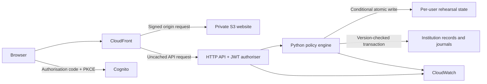

# Architecture and current limits

## Hosted environment

Separate sandbox and demo stacks use separate S3 buckets, user pools, Lambda functions, API gateways, data tables and logs in account `032312375271`, London. There is no VPC or always-on application server in this design.

All state routes require a Cognito access token with the `openid` scope. The API Gateway JWT authoriser validates issuer and client; the function also rejects a missing authenticated subject. Records are keyed by that subject plus the rehearsal identifier, never by an identity supplied in the request body.

The browser stores a short-lived access token and its workspace identifier in session storage. No client secret is shipped. Hosted user registration is invite-only. No user invitation has been sent by the source code.

## Decisions and persistence

Amounts are positive integer pence. Destination and policy values come from the backend. Hard controls override approval thresholds. Approvals re-evaluate hard controls against the current balance.

Each mutation uses an idempotency key. Replays with the same payload return existing state. Reusing a key with different input is rejected. Decisions, balance changes and audit events are saved in one conditionally written DynamoDB document. Concurrent conflicts reload and retry; a request never partially updates balances independently of the record.

The deliberately small demo bounds each session to approximately 240 audit records and caps the document below DynamoDB’s item-size limit. Use a new rehearsal for additional runs. DynamoDB TTL is seven days after mutation; expired sessions are inaccessible immediately even when physical TTL deletion is pending. Point-in-time recovery may retain earlier versions longer. Website object versions are retained for 30 days after replacement. Operational logs are retained for 14 days.

## Evidence

Each event stores a sequence, UTC timestamp, previous hash and SHA-256 hash of its canonical JSON content. The server and standalone Python verifier check the chain. An administrator who can rewrite every record can generate a new consistent chain; there is no external anchor. Do not describe this as an immutable or cryptographically attested financial ledger.

## Local rehearsal

The local HTTP server binds only to loopback, rejects cross-origin API calls and Host-header rebinding, and excludes backend source and private local paths from static serving. It substitutes a local presenter identity and a locked, atomically replaced JSON-file store. It must not be exposed publicly or used as the cloud server.

## Institution platform

The operations application uses separate records for institution metadata, memberships, invitations, policies, accounts, usage, actions, journal entries, audit events and idempotency receipts. The platform DynamoDB table has partition and sort keys, encryption, point-in-time recovery and retention on replacement/deletion. Platform records have no automatic TTL. The demonstration table retains its original seven-day session lifecycle.

Platform authentication binds the API Gateway access-token subject to Cognito GetUser and a verified email. Membership is read from the requested institution on every operation. Hosted identities must be provisioned in Cognito before they can accept an institution invitation. Local development uses separate hashed-password identities and hashed cookie sessions; its authentication module is excluded from the Lambda artifact.

Both SQLite and DynamoDB implement the same document transaction contract. Every item read, including absence, is validated at commit. Writes, audit events and idempotency receipts commit atomically. A domain failure caused by inconsistent reads is validated without applying its partial writes and retried if necessary. No external network side effect occurs inside a retryable domain callback.

Pending transfers reserve source funds and daily capacity. Approval rechecks the current mandate, proposer and reviewer authority, active accounts/institution, liquidity and daily limits. A policy revision invalidates earlier approvals; suspended/demoted reviewers are excluded. Self-approval and policy self-publication are prohibited. Settlement updates accounts, usage, the action, the journal and evidence in one transaction. Current expiry is explicit; a scheduled worker is still required.

Journal postings use integer minor units and balance separately by currency. The application exposes no edit/delete journal route. This is an application control, not external evidence immutability. The standalone export verifier checks sequence, count, hashes and balanced postings without relying on the running backend.

## Before live financial use

Not implemented or verified: real AI/model execution, bank/payment integrations, beneficiary onboarding, regulated custody/payment operations, independent evidence signing, reversals/reconciliation, scheduled expiry, deployed multi-tenant security verification, production environment/recovery, external penetration testing, incident-response ownership and service commitments. The full requirement record remains open in `platform-scope.md`.
